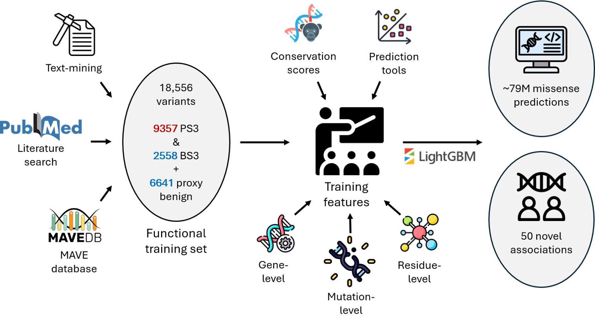

# FuncVEP

FuncVEP is a family of LightGBM classifiers for predicting the functional effect (Damaging / Neutral) of missense variants. It is trained entirely on balanced and diverse functional data, enabling improved accuracy and generalization.

- FuncVEP Web Portal: https://funcvep.bilkent.edu.tr
- Precomputed FuncVEP predictions for all possible missense variants: https://zenodo.org/records/17036008




---

## Getting Started

### Requirements

You can install required Python packages using one of the two methods below:

#### Option 1: pip

```bash
pip install -r requirements.txt
```

#### Option 2: Conda

```bash
conda env create -f environment.yml
conda activate funcvep
```

---

## Reproducing the Results

The project code is organized into numbered Jupyter notebooks and R scripts that reproduce the full FuncVEP framework.

### Jupyter Notebooks (`notebooks/`)

Run the following notebooks in order:

1. `00_download_data.ipynb` (Downloads and extracts required data from Zenodo)
2. `01_generate_esm_features.ipynb`
3. `02_extend_and_impute_features.ipynb`
4. `03_train_models.ipynb`
5. `04_test_models.ipynb`
6. `05_run_inference_on_new_variants.ipynb`
7. `06_benchmark_mave_correlation_performance.ipynb`

Optional:
- `optional_04b_shap_analysis.ipynb`
- `optional_07b_generate_benchmark_figures_and_tables.ipynb` (must be run after script `07_benchmark_prediction_performance.R`)

### R Scripts (`scripts/`)

- `07_benchmark_prediction_performance.R`

---

## Citation

The FuncVEP paper will be provided as soon as it is available.

---

## License

This project is available under the MIT license.

---
