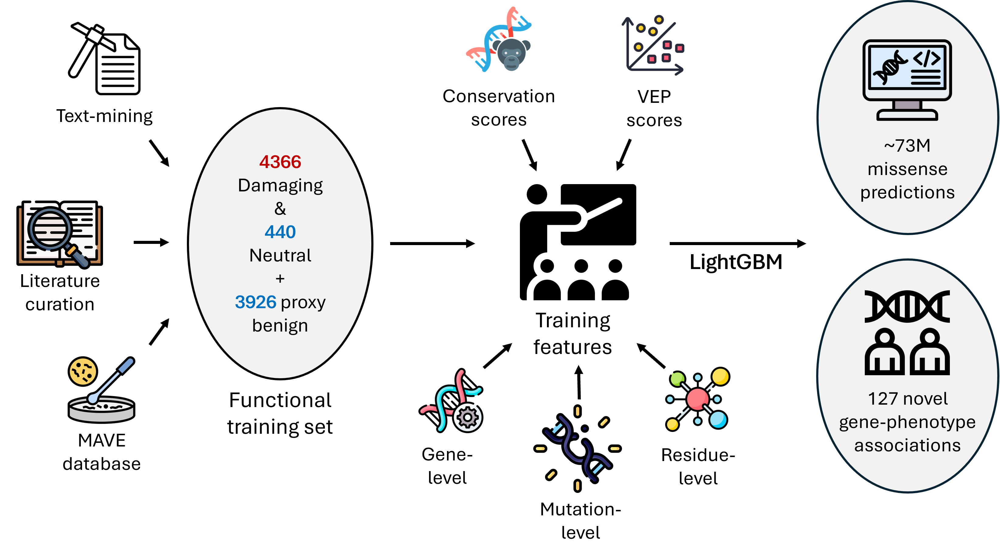

# FuncVEP

FuncVEP is a family of LightGBM classifiers for predicting the functional effect (Damaging / Neutral) of missense variants. It is trained on balanced and diverse functional data, enabling improved accuracy and generalization.

- FuncVEP Web Portal: https://funcvep.bilkent.edu.tr
- Precomputed FuncVEP scores for all possible missense variants: https://zenodo.org/records/18432730



---

## Getting Started

### Requirements

You can install required Python packages using one of the two methods below:

#### Option 1: pip

```bash
pip install -r requirements.txt
```

#### Option 2: Conda

```bash
conda env create -f environment.yml
conda activate funcvep
```

---

## Trained Models

The trained models used in this project are included in the `models/` directory.

---

## Reproducing the Results

The project code is organized into numbered Jupyter notebooks that reproduce the full FuncVEP framework.

### Jupyter Notebooks (`notebooks/`)

Run the following notebooks in order:

1. `00_download_data.ipynb` (Downloads and extracts required data from Zenodo)
2. `01_feature_imputation.ipynb`
3. `02_train_test_set_construction.ipynb`
4. `03_model_training.ipynb`
5. `04_core_variant_scoring.ipynb`
6. `05_inference_on_new_variants.ipynb`
7. `06_model_benchmarking.ipynb`
8. `07_shap_analysis.ipynb`
9. `08_benchmark_figure_generation.ipynb`

---

## Citation

If you use FuncVEP in your research, please cite:

> Kayaalp, B., Çil, K., Conil, C. *et al.* Prediction of human missense variant effects from functional evidence. *Nature Genetics* (2026). https://doi.org/10.1038/s41588-026-02727-3

---

## License

This project is available under the PolyForm Strict License.

---
